# Chat Server and Client using TCP Sockets 

## Table of Contents

- [Introduction](#introduction)
- [Required Links](#required-links)
- [File Structure](#file-structure)
- [Compilation & Execution](#compilation--execution)
- [Features](#features)
- [Additional Features](#additional-features)
- [Images](#images)
- [Submission](#submission)

## Introduction
This project implements a multi-client chat server using C++ and TCP sockets, with the C code provided as reference. The server is designed to handle multiple clients simultaneously using `threads` and the `select()` system call.

## Required Links
- [Github Repository](https://github.com/wanderer1500/ChatApp_Socket)
- [Images Folder](images/)
- [Report](Report.pdf)

## File Structure
- `server_threaded.cpp` - Multi-client chat server using threads.
- `server_select.cpp` - Multi-client chat server using the `select()` system call.
- `client.cpp` - Chat client program.
- `README.md` - This file, containing details of the project.
- `images/` - Screenshots of the running server and clients on separate hosts.
- `Report.pdf` - Contains explanations, and additional functionalities.

## Compilation & Execution
The below procedure can be followed after:
- Cloning the repository: 
  ```bash
  git clone https://github.com/wanderer1500/ChatApp_Socket
  ```
- Downloading and extracting the zip file.
- Or just downloading the server and client files.

### Compiling the Server and Client
```bash
# Compile server using threads
g++ server_threaded.cpp -o server_thread -lpthread

# Compile server using select()
g++ server_select.cpp -o server_select

# Compile client
g++ client.cpp -o client
```

### Running the Server
```bash
./server_thread [PORT]
```
or
```bash
./server_select [PORT]
```

### Running the Client
```bash
./client [SERVER_IP] [PORT]
```

## Features
<table>
    <tr>
    <td>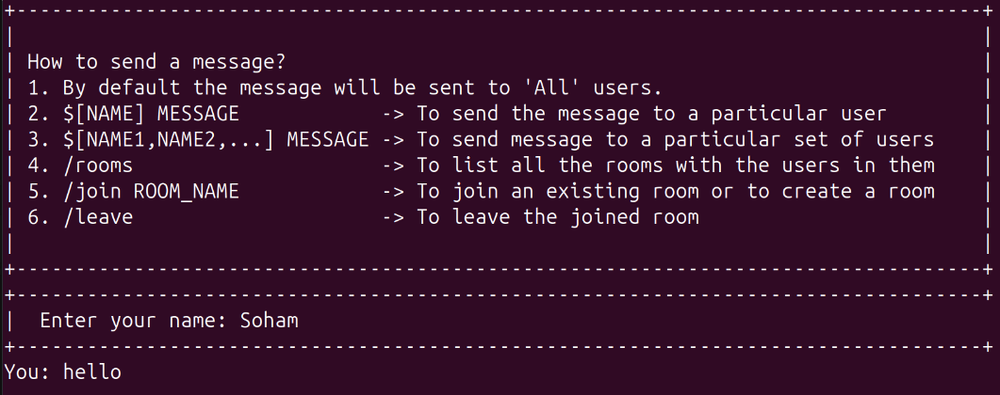</td>
    </tr>
</table>

- Multiple clients can connect to the server simultaneously.
- Clients can broadcast messages to all connected clients.
- Clients can send private messages to each other via the server.
- Clients can join or disconnect from the chat without affecting others.

## Additional Features
- Clients can send private messages to a group of people.
- Clients can join an existing room, or create a room.
- Clients can send messages to people in that room or leave out of that room.
- Server handles client timeout and disconnections.

## Images
- **Broadcast Messages**  
<table>
    <tr>
    <td>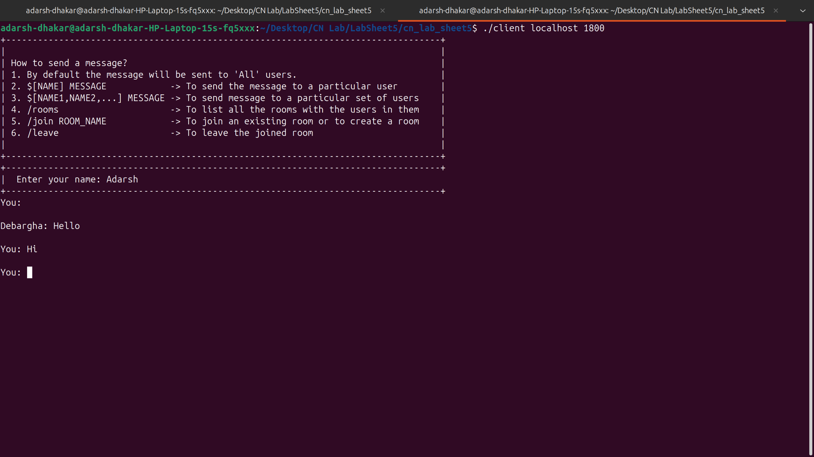</td>
    <td>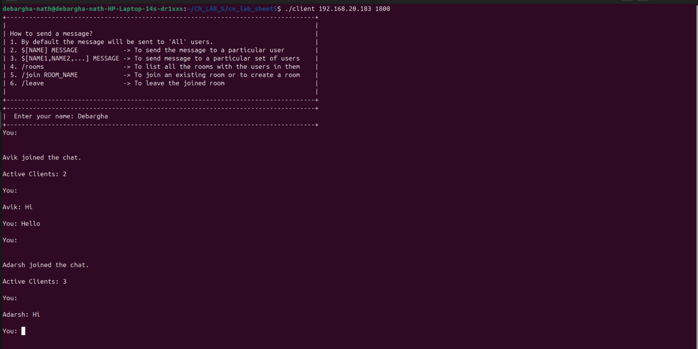</td>
    </tr>
</table>
<table>
    <tr>
    <td>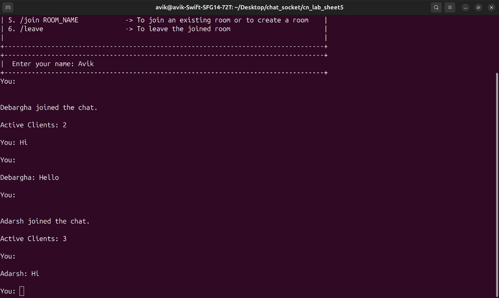</td>
    </tr>
</table>

- **Private and Direct Messaging**  
<table>
    <tr>
    <td>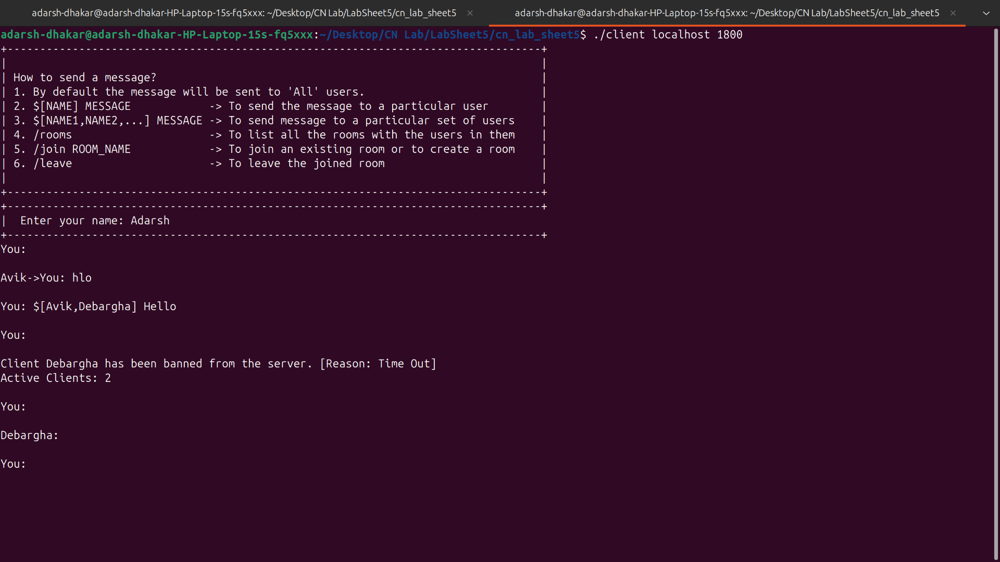</td>
    <td>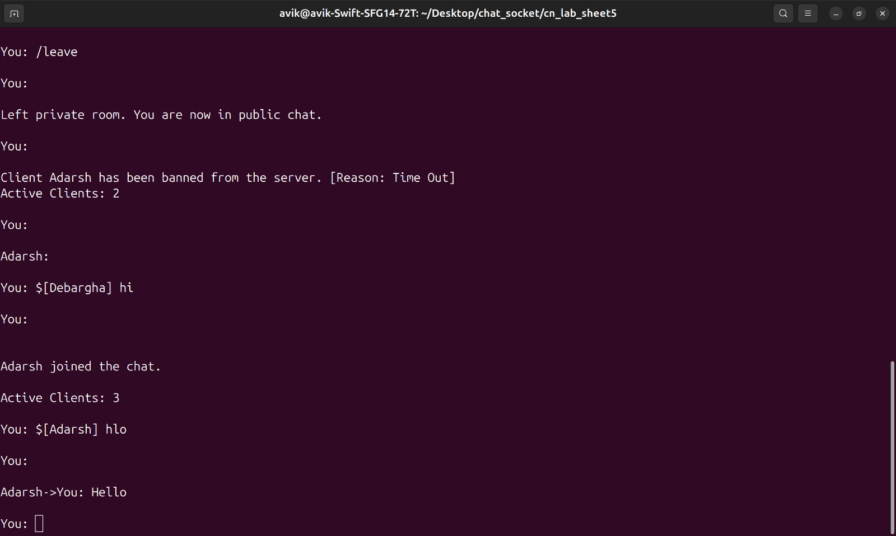</td>
    </tr>
</table>
<table>
    <tr>
    <td>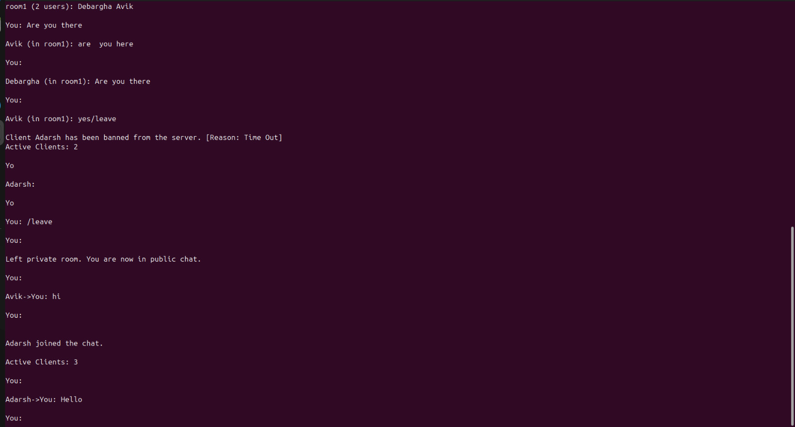</td>
    </tr>
</table>

- **Join a room, message, leave a room**  
<table>
    <tr>
    <td>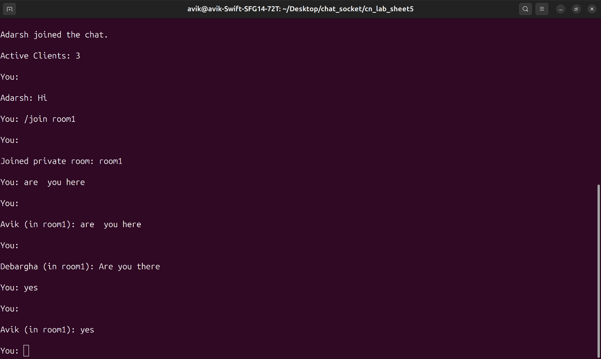</td>
    <td>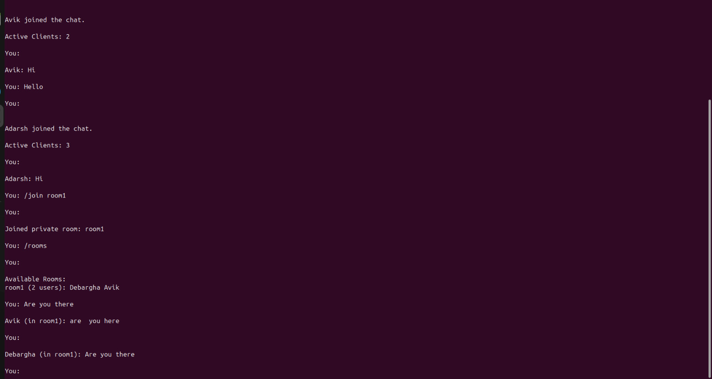</td>
    </tr>
</table>
<table>
    <tr>
    <td></td>
    </tr>
</table>

- **Exit, Timeout** 
<table>
    <tr>
    <td>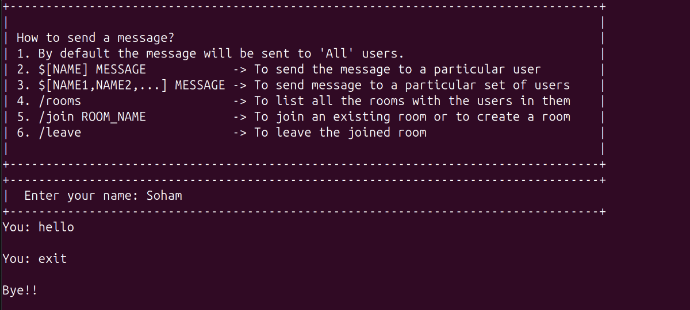</td>
    <td>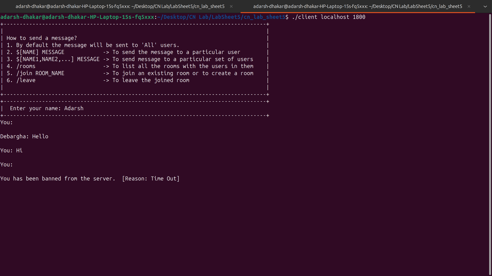</td>
    </tr>
</table>

## Submission
- All codes are included in a zip file and the directory too.
- Report with explanations and images is attached.
- Github link for the repository, report.

